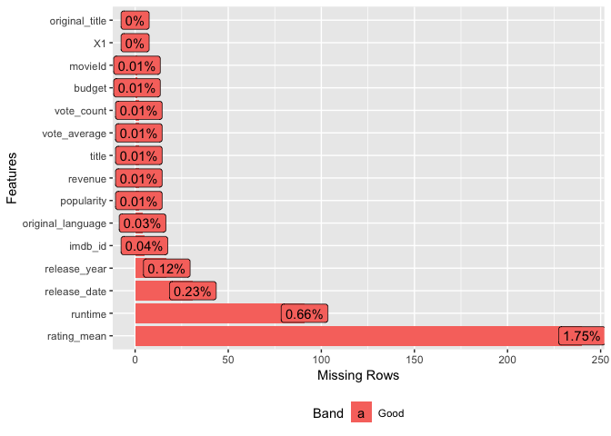
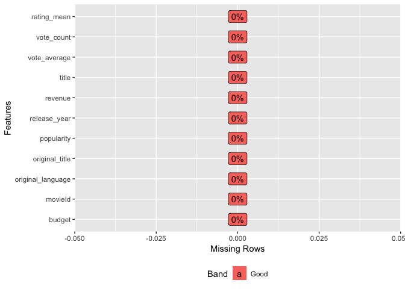
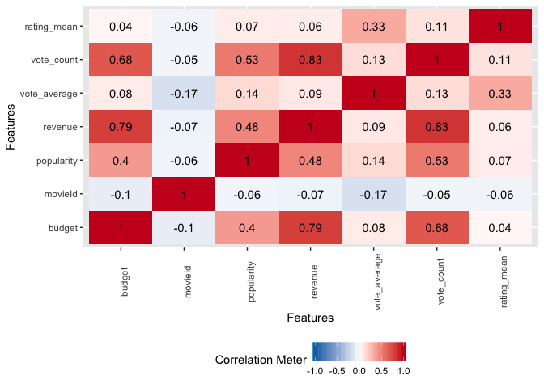
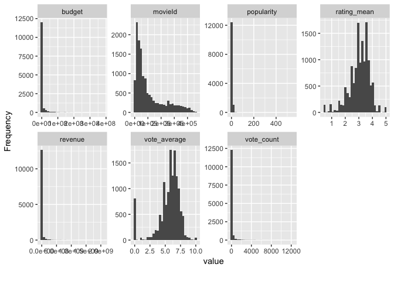
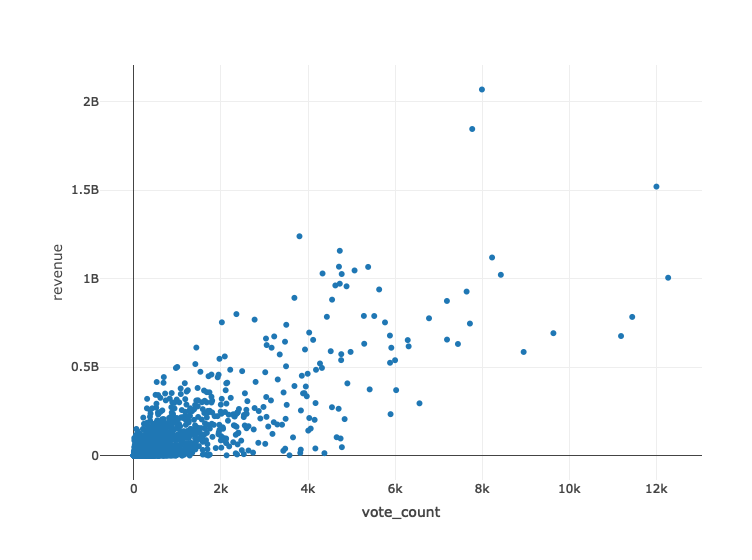
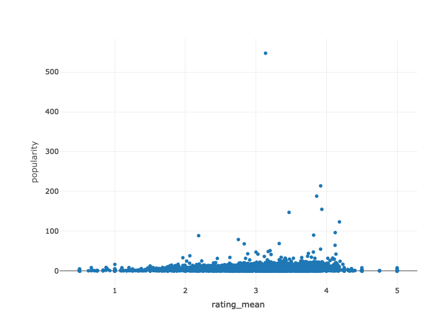
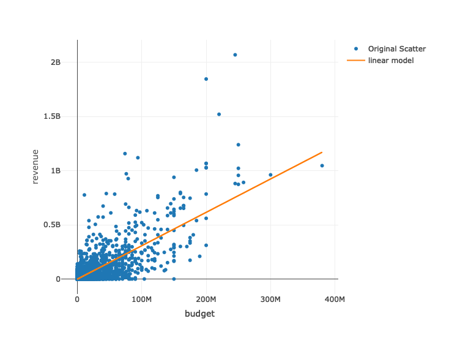
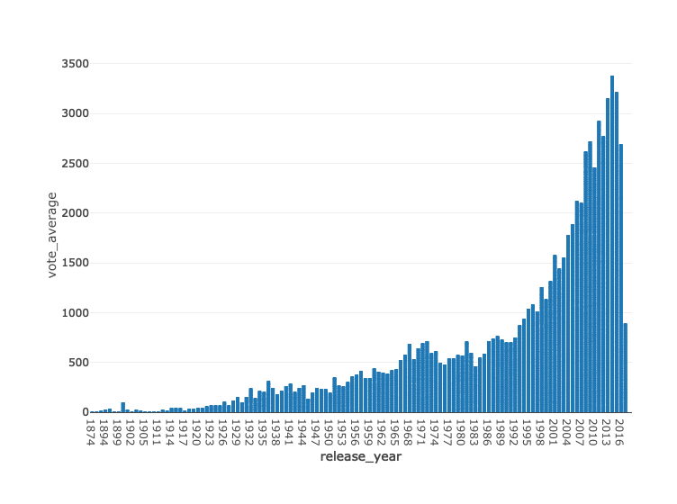

Laboratorio 10
================
Melany 20170474
11/2/2019

``` r
library(readr)
library(dplyr)
```

    ## Warning: package 'dplyr' was built under R version 3.5.2

    ## 
    ## Attaching package: 'dplyr'

    ## The following objects are masked from 'package:stats':
    ## 
    ##     filter, lag

    ## The following objects are masked from 'package:base':
    ## 
    ##     intersect, setdiff, setequal, union

``` r
library(tidyr)
library(plotly)
```

    ## Loading required package: ggplot2

    ## 
    ## Attaching package: 'plotly'

    ## The following object is masked from 'package:ggplot2':
    ## 
    ##     last_plot

    ## The following object is masked from 'package:stats':
    ## 
    ##     filter

    ## The following object is masked from 'package:graphics':
    ## 
    ##     layout

``` r
library(DataExplorer)
```

    ## Warning: package 'DataExplorer' was built under R version 3.5.2

``` r
df_movies <- read_csv('/Users/melany/Desktop/Data Wrangling/Github/Laboratorio 10/movies.csv')
```

    ## Warning: Missing column names filled in: 'X1' [1]

    ## Parsed with column specification:
    ## cols(
    ##   X1 = col_double(),
    ##   budget = col_double(),
    ##   id = col_double(),
    ##   imdb_id = col_character(),
    ##   original_language = col_character(),
    ##   original_title = col_character(),
    ##   popularity = col_double(),
    ##   release_year = col_double(),
    ##   release_date = col_character(),
    ##   revenue = col_double(),
    ##   runtime = col_double(),
    ##   title = col_character(),
    ##   vote_average = col_double(),
    ##   vote_count = col_double()
    ## )

``` r
df_ratings <- read_csv('/Users/melany/Desktop/Data Wrangling/Github/Laboratorio 10/ratings.csv')
```

    ## Warning: Missing column names filled in: 'X1' [1]

    ## Parsed with column specification:
    ## cols(
    ##   X1 = col_double(),
    ##   userId = col_double(),
    ##   movieId = col_double(),
    ##   rating = col_double(),
    ##   timestamp = col_double()
    ## )

``` r
head(df_movies)
```

    ## # A tibble: 6 x 14
    ##      X1 budget    id imdb_id original_langua… original_title popularity
    ##   <dbl>  <dbl> <dbl> <chr>   <chr>            <chr>               <dbl>
    ## 1     1 3.00e7   862 tt0114… en               Toy Story           21.9 
    ## 2     2 6.50e7  8844 tt0113… en               Jumanji             17.0 
    ## 3     3 1.60e7 31357 tt0114… en               Waiting to Ex…       3.86
    ## 4     4 0.     45325 tt0112… en               Tom and Huck         2.56
    ## 5     5 3.50e7  9091 tt0114… en               Sudden Death         5.23
    ## 6     6 0.     12110 tt0112… en               Dracula: Dead…       5.43
    ## # … with 7 more variables: release_year <dbl>, release_date <chr>,
    ## #   revenue <dbl>, runtime <dbl>, title <chr>, vote_average <dbl>,
    ## #   vote_count <dbl>

``` r
head(df_ratings)
```

    ## # A tibble: 6 x 5
    ##      X1 userId movieId rating  timestamp
    ##   <dbl>  <dbl>   <dbl>  <dbl>      <dbl>
    ## 1     1      1   10474    4.5 1425942435
    ## 2     2      1    2108    4   1425942148
    ## 3     3      1     745    4.5 1425941300
    ## 4     4      1      77    4   1425942228
    ## 5     5      1     141    5   1425941434
    ## 6     6      1    9685    5   1425941397

``` r
colnames(df_movies)[which(names(df_movies) == "id")] <- "movieId"
ratings <- df_ratings %>% group_by(movieId) %>% summarise(rating_mean = mean(rating))
df <- left_join(df_movies, ratings,  by = 'movieId')
head(df)
```

    ## # A tibble: 6 x 15
    ##      X1 budget movieId imdb_id original_langua… original_title popularity
    ##   <dbl>  <dbl>   <dbl> <chr>   <chr>            <chr>               <dbl>
    ## 1     1 3.00e7     862 tt0114… en               Toy Story           21.9 
    ## 2     2 6.50e7    8844 tt0113… en               Jumanji             17.0 
    ## 3     3 1.60e7   31357 tt0114… en               Waiting to Ex…       3.86
    ## 4     4 0.       45325 tt0112… en               Tom and Huck         2.56
    ## 5     5 3.50e7    9091 tt0114… en               Sudden Death         5.23
    ## 6     6 0.       12110 tt0112… en               Dracula: Dead…       5.43
    ## # … with 8 more variables: release_year <dbl>, release_date <chr>,
    ## #   revenue <dbl>, runtime <dbl>, title <chr>, vote_average <dbl>,
    ## #   vote_count <dbl>, rating_mean <dbl>

``` r
glimpse(df)
```

    ## Observations: 13,687
    ## Variables: 15
    ## $ X1                <dbl> 1, 2, 3, 4, 5, 6, 7, 8, 9, 10, 11, 12, 13, 14,…
    ## $ budget            <dbl> 3.0e+07, 6.5e+07, 1.6e+07, 0.0e+00, 3.5e+07, 0…
    ## $ movieId           <dbl> 862, 8844, 31357, 45325, 9091, 12110, 10858, 9…
    ## $ imdb_id           <chr> "tt0114709", "tt0113497", "tt0114885", "tt0112…
    ## $ original_language <chr> "en", "en", "en", "en", "en", "en", "en", "en"…
    ## $ original_title    <chr> "Toy Story", "Jumanji", "Waiting to Exhale", "…
    ## $ popularity        <dbl> 21.946943, 17.015539, 3.859495, 2.561161, 5.23…
    ## $ release_year      <dbl> 1995, 1995, 1995, 1995, 1995, 1995, 1995, 1995…
    ## $ release_date      <chr> "10/30/95", "12/15/95", "12/22/95", "12/22/95"…
    ## $ revenue           <dbl> 373554033, 262797249, 81452156, 0, 64350171, 0…
    ## $ runtime           <dbl> 81, 104, 127, 97, 106, 88, 192, 90, 132, 123, …
    ## $ title             <chr> "Toy Story", "Jumanji", "Waiting to Exhale", "…
    ## $ vote_average      <dbl> 7.7, 6.9, 6.1, 5.4, 5.5, 5.7, 7.1, 6.1, 6.0, 7…
    ## $ vote_count        <dbl> 5415, 2413, 34, 45, 174, 210, 72, 1128, 394, 3…
    ## $ rating_mean       <dbl> 3.888157, 3.236953, 2.875713, 3.129191, 3.0083…

``` r
colSums(is.na(df))
```

    ##                X1            budget           movieId           imdb_id 
    ##                 0                 1                 1                 5 
    ## original_language    original_title        popularity      release_year 
    ##                 4                 0                 2                17 
    ##      release_date           revenue           runtime             title 
    ##                31                 2                91                 2 
    ##      vote_average        vote_count       rating_mean 
    ##                 2                 2               240

``` r
plot_missing(df)
```

<!-- -->

``` r
library(stringr)
```

    ## Warning: package 'stringr' was built under R version 3.5.2

``` r
df[is.na(df$release_year),]
```

    ## # A tibble: 17 x 15
    ##       X1 budget movieId imdb_id original_langua… original_title popularity
    ##    <dbl>  <dbl>   <dbl> <chr>   <chr>            <chr>               <dbl>
    ##  1  6032      0     160 tt0000… es               L'arrivée d'u…     5.26  
    ##  2  8634      0   33229 tt0241… xx               Dickson Greet…     1.04  
    ##  3 10014      0  178755 tt0256… fr               Cortège arabe      0.0526
    ##  4 10522      0  194079 tt2221… en               Sallie Gardne…     0.328 
    ##  5 10523      0  315946 tt3155… xx               Passage de Ve…     0.480 
    ##  6 10566      0   33318 tt0241… xx               Men Boxing         0.619 
    ##  7 12358      0  114108 tt0000… fr               Cendrillon         1.30  
    ##  8 12578      0  416258 tt5447… en               Two Fencers        0.0365
    ##  9 12590      0  186019 tt0203… en               Souvenir Stri…     0.809 
    ## 10 12615      0  144393 tt0229… en               Annie Oakley       0.405 
    ## 11 12616      0  163053 tt0203… en               A Morning Bath     0.262 
    ## 12 12701      0  154339 tt2049… en               Falling Cat        1.47  
    ## 13 12866      0  155107 tt0309… en               Buffalo Dance      0.206 
    ## 14 13105      0  133063 tt0000… xx               Le manoir du …     1.54  
    ## 15 13186      0   16612 tt0000… en               Carmencita         1.27  
    ## 16 13442      0  104460 tt0000… fr               Une partie de…     0.326 
    ## 17 13617      0  104700 tt0000… fr               La lune à un …     0.229 
    ## # … with 8 more variables: release_year <dbl>, release_date <chr>,
    ## #   revenue <dbl>, runtime <dbl>, title <chr>, vote_average <dbl>,
    ## #   vote_count <dbl>, rating_mean <dbl>

``` r
for (i in df$X1){
  if (is.na(df$release_year[which(df$X1 == i)])){
    df$release_year[which(df$X1 == i)] <- str_extract(string = df$release_date[which(df$X1 == i)], pattern = "^[0-9]{4}")
  }
}
df[is.na(df$release_year),]
```

    ## # A tibble: 0 x 15
    ## # … with 15 variables: X1 <dbl>, budget <dbl>, movieId <dbl>,
    ## #   imdb_id <chr>, original_language <chr>, original_title <chr>,
    ## #   popularity <dbl>, release_year <chr>, release_date <chr>,
    ## #   revenue <dbl>, runtime <dbl>, title <chr>, vote_average <dbl>,
    ## #   vote_count <dbl>, rating_mean <dbl>

``` r
for (i in df$X1){
  if (is.na(df$title[which(df$X1 == i)])){
    df$title[which(df$X1 == i)] <- df$original_title[which(df$X1 == i)]
  }
}
```

``` r
completeFun <- function(data, Col) {
  complete <- complete.cases(data[, Col])
  return(data[complete, ])
}

df<- completeFun(df, "rating_mean")
df<- completeFun(df, "movieId")
df<- completeFun(df, "original_language")
```

``` r
df$revenue <- replace(df$revenue, is.na(df$revenue), 0)
df$budget <- replace(df$budget, is.na(df$budget), 0)
```

``` r
find.mode <- function(v) {
   uniqv <- unique(v)
   uniqv[which.max(tabulate(match(v, uniqv)))]
}
df$popularity[is.na(df$popularity)] <- find.mode(df$popularity)
df$vote_average[is.na(df$vote_average)] <- find.mode(df$vote_average)
df$vote_count[is.na(df$vote_count)] <- find.mode(df$vote_count)
```

``` r
drop <- c("imdb_id","runtime", "release_date", "X1")
df <- df[ , !(names(df) %in% drop)]
```

``` r
colSums(is.na(df))
```

    ##            budget           movieId original_language    original_title 
    ##                 0                 0                 0                 0 
    ##        popularity      release_year           revenue             title 
    ##                 0                 0                 0                 0 
    ##      vote_average        vote_count       rating_mean 
    ##                 0                 0                 0

``` r
plot_missing(df)
```

<!-- -->

``` r
summary(df)
```

    ##      budget             movieId       original_language 
    ##  Min.   :        0   Min.   :    11   Length:13442      
    ##  1st Qu.:        0   1st Qu.: 25673   Class :character  
    ##  Median :        0   Median : 56985   Mode  :character  
    ##  Mean   :  4341439   Mean   :105663                     
    ##  3rd Qu.:        0   3rd Qu.:149166                     
    ##  Max.   :380000000   Max.   :462788                     
    ##  original_title       popularity       release_year      
    ##  Length:13442       Min.   :  0.0000   Length:13442      
    ##  Class :character   1st Qu.:  0.4072   Class :character  
    ##  Mode  :character   Median :  1.1695   Mode  :character  
    ##                     Mean   :  3.0134                     
    ##                     3rd Qu.:  3.7085                     
    ##                     Max.   :547.4883                     
    ##     revenue             title            vote_average      vote_count     
    ##  Min.   :0.000e+00   Length:13442       Min.   : 0.000   Min.   :    0.0  
    ##  1st Qu.:0.000e+00   Class :character   1st Qu.: 5.000   1st Qu.:    3.0  
    ##  Median :0.000e+00   Mode  :character   Median : 6.000   Median :   10.0  
    ##  Mean   :1.220e+07                      Mean   : 5.639   Mean   :  117.5  
    ##  3rd Qu.:0.000e+00                      3rd Qu.: 6.800   3rd Qu.:   35.0  
    ##  Max.   :2.068e+09                      Max.   :10.000   Max.   :12269.0  
    ##   rating_mean   
    ##  Min.   :0.500  
    ##  1st Qu.:2.682  
    ##  Median :3.152  
    ##  Mean   :3.055  
    ##  3rd Qu.:3.500  
    ##  Max.   :5.000

``` r
plot_correlation(df)
```

    ## Warning in dummify(data, maxcat = maxcat): Ignored all discrete features
    ## since `maxcat` set to 20 categories!

<!-- -->

``` r
plot_histogram(df)
```

<!-- -->

``` r
df %>%  plot_ly(x = ~vote_count, y = ~revenue, type = "scatter")
```

    ## No scatter mode specifed:
    ##   Setting the mode to markers
    ##   Read more about this attribute -> https://plot.ly/r/reference/#scatter-mode

<!-- -->

``` r
df %>%  plot_ly(x = ~rating_mean, y = ~popularity, type = "scatter")
```

    ## No scatter mode specifed:
    ##   Setting the mode to markers
    ##   Read more about this attribute -> https://plot.ly/r/reference/#scatter-mode

<!-- -->

``` r
lm1 <- lm(formula = revenue ~ budget, data = df)
df %>%  plot_ly(x = ~budget, y = ~revenue, type = "scatter", mode = "markers", name = "Original Scatter") %>% 
  add_trace(x = ~budget, y = fitted.values(lm1), mode= 'lines', name = 'linear model')
```

<!-- -->

``` r
df %>%  plot_ly(x = ~release_year, y = ~vote_average, type = "bar")
```

<!-- -->
