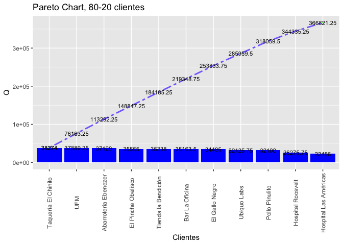
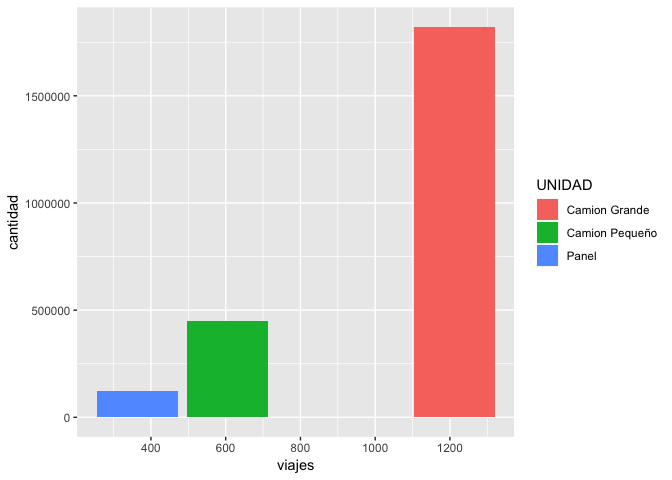
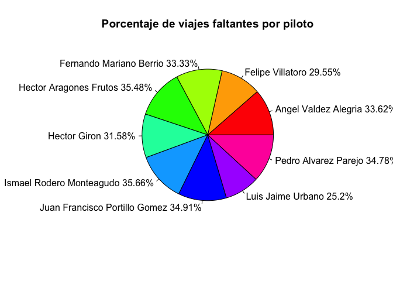
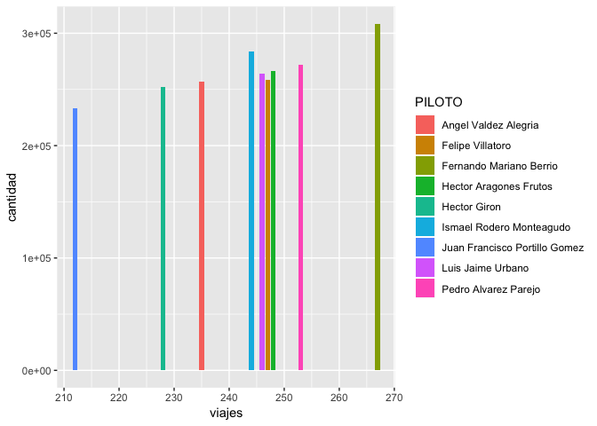

Laboratorio 3
================
Melany 20170474
8/14/2019

``` r
library(tidyverse)
```

    ## ── Attaching packages ───────────────

    ## ✔ ggplot2 3.0.0     ✔ purrr   0.2.5
    ## ✔ tibble  2.1.3     ✔ dplyr   0.8.3
    ## ✔ tidyr   0.8.1     ✔ stringr 1.4.0
    ## ✔ readr   1.3.1     ✔ forcats 0.3.0

    ## Warning: package 'tibble' was built under R version 3.5.2

    ## Warning: package 'dplyr' was built under R version 3.5.2

    ## Warning: package 'stringr' was built under R version 3.5.2

    ## ── Conflicts ────────────────────────
    ## ✖ dplyr::filter() masks stats::filter()
    ## ✖ dplyr::lag()    masks stats::lag()

``` r
library(readr)
library(stringr)
datos <- read_csv('tabla_completa.csv')
```

    ## Warning: Missing column names filled in: 'X1' [1]

    ## Parsed with column specification:
    ## cols(
    ##   X1 = col_double(),
    ##   COD_VIAJE = col_double(),
    ##   CLIENTE = col_character(),
    ##   UBICACION = col_double(),
    ##   CANTIDAD = col_double(),
    ##   PILOTO = col_character(),
    ##   Q = col_double(),
    ##   CREDITO = col_double(),
    ##   UNIDAD = col_character(),
    ##   MES = col_double(),
    ##   ANIO = col_double()
    ## )

``` r
head(datos)
```

    ## # A tibble: 6 x 11
    ##      X1 COD_VIAJE CLIENTE UBICACION CANTIDAD PILOTO     Q CREDITO UNIDAD
    ##   <dbl>     <dbl> <chr>       <dbl>    <dbl> <chr>  <dbl>   <dbl> <chr> 
    ## 1     1  10000001 EL PIN…     76002     1200 Ferna… 300        30 Camio…
    ## 2     2  10000002 TAQUER…     76002     1433 Hecto… 358.       90 Camio…
    ## 3     3  10000003 TIENDA…     76002     1857 Pedro… 464.       60 Camio…
    ## 4     4  10000004 TAQUER…     76002      339 Angel…  84.8      30 Panel 
    ## 5     5  10000005 CHICHA…     76001     1644 Juan … 411        30 Camio…
    ## 6     6  10000006 UBIQUO…     76001     1827 Luis … 457.       30 Camio…
    ## # … with 2 more variables: MES <dbl>, ANIO <dbl>

``` r
colSums(is.na(datos))
```

    ##        X1 COD_VIAJE   CLIENTE UBICACION  CANTIDAD    PILOTO         Q 
    ##         0         0         0         0         0         0         0 
    ##   CREDITO    UNIDAD       MES      ANIO 
    ##         0         0         0         0

``` r
datos$UNIDAD <- str_replace_all(datos$UNIDAD, '�', 'ñ')
datos
```

    ## # A tibble: 2,180 x 11
    ##       X1 COD_VIAJE CLIENTE UBICACION CANTIDAD PILOTO     Q CREDITO UNIDAD
    ##    <dbl>     <dbl> <chr>       <dbl>    <dbl> <chr>  <dbl>   <dbl> <chr> 
    ##  1     1  10000001 EL PIN…     76002     1200 Ferna… 300        30 Camio…
    ##  2     2  10000002 TAQUER…     76002     1433 Hecto… 358.       90 Camio…
    ##  3     3  10000003 TIENDA…     76002     1857 Pedro… 464.       60 Camio…
    ##  4     4  10000004 TAQUER…     76002      339 Angel…  84.8      30 Panel 
    ##  5     5  10000005 CHICHA…     76001     1644 Juan … 411        30 Camio…
    ##  6     6  10000006 UBIQUO…     76001     1827 Luis … 457.       30 Camio…
    ##  7     7  10000007 CHICHA…     76002     1947 Ismae… 487.       90 Camio…
    ##  8     8  10000008 TAQUER…     76001     1716 Juan … 429        60 Camio…
    ##  9     9  10000009 EL GAL…     76002     1601 Ismae… 400.       30 Camio…
    ## 10    10  10000010 CHICHA…     76002     1343 Ferna… 336.       90 Camio…
    ## # … with 2,170 more rows, and 2 more variables: MES <dbl>, ANIO <dbl>

``` r
#¿Debemos invertir en la contratación de más personal?
#Son 9 pilotos los que tienen contratados
datos %>% select(PILOTO) %>% distinct() 
```

    ## # A tibble: 9 x 1
    ##   PILOTO                       
    ##   <chr>                        
    ## 1 Fernando Mariano Berrio      
    ## 2 Hector Aragones Frutos       
    ## 3 Pedro Alvarez Parejo         
    ## 4 Angel Valdez Alegria         
    ## 5 Juan Francisco Portillo Gomez
    ## 6 Luis Jaime Urbano            
    ## 7 Ismael Rodero Monteagudo     
    ## 8 Felipe Villatoro             
    ## 9 Hector Giron

``` r
#Promedio de quetzales y de la cantidad de productos entregados por piloto
datos %>% select(PILOTO, Q, CANTIDAD) %>% group_by(PILOTO) %>% summarise(PromedioQ = mean(Q),PromedioCantidad = mean(CANTIDAD)) %>% arrange(desc(PromedioQ))
```

    ## # A tibble: 9 x 3
    ##   PILOTO                        PromedioQ PromedioCantidad
    ##   <chr>                             <dbl>            <dbl>
    ## 1 Ismael Rodero Monteagudo           291.            1163.
    ## 2 Fernando Mariano Berrio            289.            1155.
    ## 3 Hector Giron                       276.            1104.
    ## 4 Juan Francisco Portillo Gomez      275.            1101.
    ## 5 Angel Valdez Alegria               274.            1095.
    ## 6 Hector Aragones Frutos             269.            1075.
    ## 7 Pedro Alvarez Parejo               269.            1074.
    ## 8 Luis Jaime Urbano                  268.            1073.
    ## 9 Felipe Villatoro                   262.            1047.

``` r
#Ingreso total que hacen todos los pilotos, el promedio de quetzales que hace cada uno y los quetzales que hacen cada uno al mes
TotalQ = sum(datos$Q)
PromedioQ = TotalQ/9
QMensual = PromedioQ/11
TotalQ = format(TotalQ, big.mark = ",")
PromedioQ = format(PromedioQ, big.mark = ",")
QMensual = format(QMensual, big.mark = ",")
tabla = data.frame(TotalQ, PromedioQ, QMensual)
tabla
```

    ##      TotalQ PromedioQ  QMensual
    ## 1 598,848.2 66,538.69 6,048.972

``` r
#El total de quetzales que en realidad hace cada uno
datos %>% select(PILOTO, Q) %>% group_by(PILOTO) %>% summarise(TotalQ = sum(Q)) %>% arrange(desc(TotalQ)) 
```

    ## # A tibble: 9 x 2
    ##   PILOTO                        TotalQ
    ##   <chr>                          <dbl>
    ## 1 Fernando Mariano Berrio       77097.
    ## 2 Ismael Rodero Monteagudo      70936.
    ## 3 Pedro Alvarez Parejo          67940.
    ## 4 Hector Aragones Frutos        66645.
    ## 5 Luis Jaime Urbano             65992.
    ## 6 Felipe Villatoro              64626.
    ## 7 Angel Valdez Alegria          64308.
    ## 8 Hector Giron                  62955.
    ## 9 Juan Francisco Portillo Gomez 58347.

``` r
#En promedio, los 9 pilotos obtienen cantidades de ganancia similares, al igual que la cantidad de productos que transportan. Según los ingresos totales de los viajes, en promedio cada piloto deberia de obtener un total Q66,500 anual, sin embargo la empresa debería de reconsiderar si las personas que hacen menos o una cantidad baja como Q58,000 deberia seguir trabajando en la empresa, suponiendo que no esta rindiendo las ganancias suficientes para la empresa. Por lo que se debería considerar la opción de contratar a una persona que sea eficiente y que pueda alcanzar los requerimientos de la empresa, es decir, que pueda hacer ganancias mayores al promedio, por ejemplo, el piloto que hace hasta Q77,000. Además, la empresa tendría que analizar si tener una ganancia promedio por piloto mensual de Q6,000 es suficiente para cubrir los costos y el salario del piloto, tomando en cuenta que el salario mínimo es de Q3,000. La única manera rentable de contratar a alguien es si se asegura que éste tendra un rendimiento mayor al promedio para mejorar los ingresos de la empresa.
```

``` r
#¿Debemos invertir en la compra de más vehículos de distribución? ¿Cuántos y de que tipo?
#Tipos de vehículos que tiene la empresa
datos %>% select(UNIDAD) %>% group_by(UNIDAD) %>% distinct()
```

    ## # A tibble: 3 x 1
    ## # Groups:   UNIDAD [3]
    ##   UNIDAD        
    ##   <chr>         
    ## 1 Camion Grande 
    ## 2 Panel         
    ## 3 Camion Pequeño

``` r
#Promedio de la cantidad de productos que transporta cada vehículo y el total de viajes que hace cada uno
datos %>% select(UNIDAD, CANTIDAD, COD_VIAJE) %>% group_by(UNIDAD) %>% summarise(PromedioCantidad = mean(CANTIDAD),viajes = n_distinct(COD_VIAJE)) %>% distinct()
```

    ## # A tibble: 3 x 3
    ##   UNIDAD         PromedioCantidad viajes
    ##   <chr>                     <dbl>  <int>
    ## 1 Camion Grande             1504.   1211
    ## 2 Camion Pequeño             746.    605
    ## 3 Panel                      336.    364

``` r
#Número de viajes que hace cada vehículo por ubicación
datos %>% select(UNIDAD, UBICACION,COD_VIAJE) %>% group_by(UNIDAD, UBICACION) %>% summarise(viajes = n_distinct(COD_VIAJE)) %>% distinct()
```

    ## # A tibble: 6 x 3
    ## # Groups:   UNIDAD [3]
    ##   UNIDAD         UBICACION viajes
    ##   <chr>              <dbl>  <int>
    ## 1 Camion Grande      76001    615
    ## 2 Camion Grande      76002    596
    ## 3 Camion Pequeño     76001    287
    ## 4 Camion Pequeño     76002    318
    ## 5 Panel              76001    183
    ## 6 Panel              76002    181

``` r
#Total de viajes por ubicación
datos %>% select(UNIDAD, UBICACION,COD_VIAJE) %>% group_by(UBICACION) %>% summarise(viajes = n_distinct(COD_VIAJE)) %>% distinct()
```

    ## # A tibble: 2 x 2
    ##   UBICACION viajes
    ##       <dbl>  <int>
    ## 1     76001   1085
    ## 2     76002   1095

``` r
#Numero de viajes por vehículo
t = data.frame(datos %>% select(UNIDAD, COD_VIAJE) %>% group_by(UNIDAD) %>% summarise(TotalViajes = n_distinct(COD_VIAJE)) %>% arrange(desc(TotalViajes)))
#Nuevo dataframe con los viajes que tienen faltante
faltante1 = data.frame(datos[grep("Faltante",datos$CLIENTE),])
faltante2 = data.frame(datos[grep("FALTANTE",datos$CLIENTE),])
faltante = rbind(faltante1,faltante2)
#Numero de viajes faltantes por vehículo
f = data.frame(faltante %>% select(UNIDAD,COD_VIAJE) %>% group_by(UNIDAD) %>% summarise(ViajesFaltantes = n_distinct(COD_VIAJE)) %>% arrange(desc(ViajesFaltantes)))
f
```

    ##           UNIDAD ViajesFaltantes
    ## 1  Camion Grande             412
    ## 2 Camion Pequeño             189
    ## 3          Panel             111

``` r
#Dataframe con todos los viajes y los faltantes por piloto
all = merge(t,f, by="UNIDAD")
#Porcentaje de viajes faltantes por el total de viajes
all$Porcentaje = (all$ViajesFaltantes/all$TotalViajes)*100
all %>% select(everything()) %>% arrange(desc(Porcentaje))
```

    ##           UNIDAD TotalViajes ViajesFaltantes Porcentaje
    ## 1  Camion Grande        1211             412   34.02147
    ## 2 Camion Pequeño         605             189   31.23967
    ## 3          Panel         364             111   30.49451

``` r
#Cantidad de viajes que realiza cada piloto en cada vehículos y la cantidad de viajes que se hace en total en cada vehículo
p = data.frame(datos %>% select(PILOTO,UNIDAD) %>% group_by(PILOTO) %>% count(UNIDAD)%>% distinct())
v = data.frame(datos %>% select(UNIDAD,COD_VIAJE) %>% group_by(UNIDAD) %>% summarise(viajes = n_distinct(COD_VIAJE))%>% distinct())
#Dataframe con todos los viajes de los vehículos y los del piloto en cada vehículo
all = merge(p,v, by="UNIDAD")
#Porcentaje de viajes que cada piloto hace en el camión grande por el total de viajes
all$Porcentaje = (all$n/all$viajes)*100
all = data.frame(all[grep("Camion Grande",all$UNIDAD),])
all %>% select(everything()) %>% arrange(desc(Porcentaje))
```

    ##          UNIDAD                        PILOTO   n viajes Porcentaje
    ## 1 Camion Grande       Fernando Mariano Berrio 157   1211   12.96449
    ## 2 Camion Grande      Ismael Rodero Monteagudo 149   1211   12.30388
    ## 3 Camion Grande             Luis Jaime Urbano 136   1211   11.23039
    ## 4 Camion Grande          Angel Valdez Alegria 135   1211   11.14781
    ## 5 Camion Grande          Pedro Alvarez Parejo 134   1211   11.06524
    ## 6 Camion Grande        Hector Aragones Frutos 132   1211   10.90008
    ## 7 Camion Grande              Felipe Villatoro 126   1211   10.40462
    ## 8 Camion Grande                  Hector Giron 123   1211   10.15690
    ## 9 Camion Grande Juan Francisco Portillo Gomez 119   1211    9.82659

``` r
#Cantidad de viajes 
cg = data.frame(datos[grep("Camion Grande",datos$UNIDAD),])
cg = data.frame(cg %>% select(MES,COD_VIAJE) %>% group_by(MES) %>% summarise(ViajesCamionGrande = n_distinct(COD_VIAJE)) %>% distinct())
cg$ViajesPiloto = (cg$ViajesCamionGrande/9)
cg
```

    ##    MES ViajesCamionGrande ViajesPiloto
    ## 1    1                122     13.55556
    ## 2    2                114     12.66667
    ## 3    3                 98     10.88889
    ## 4    4                101     11.22222
    ## 5    5                117     13.00000
    ## 6    6                107     11.88889
    ## 7    7                121     13.44444
    ## 8    8                102     11.33333
    ## 9    9                102     11.33333
    ## 10  10                108     12.00000
    ## 11  11                119     13.22222

``` r
#De los 3 vehículos, el más rentable es el camión grande porque es el que más viajes hace y el que más productos transporta en promedio. El camión grande y el panel transporta más a la ubicación 76001 y el camión pequeño va más al 76002. Sin embargo, la ubicación a la que más entregan es el 76002. El camión grande es el que tiene un mayor porcentaje de faltantes, esto podría ser culpa del piloto y no del vehículo. Aún asi, el camión grande es el más rentable porque sus números duplican a los del camión pequeño que a su vez, duplican los del panel. Debido a la cantidad de productos que pueden transportar, el mejor vehículo para invertir es el camión grande. Suponiendo que se tiene un camión grande por cada piloto (ya que no se sabe exactamente cuantos tiene la empresa de cada vehículo), la cantidad de camiones a comprar depende de si se contrata pilotos nuevos o si los pedidos aumentan para ese vehículo. Ya que, si mensual cada piloto haría de 10 a 13 viajes y los viajes son muy largos, es necesario que cada uno tenga un camión para poder hacer todas las entregas.
```

``` r
#Las tarifas actuales ¿son aceptables por el cliente?
#Número de viajes de cada cliente
datos %>% select(CLIENTE) %>% count(CLIENTE) %>% distinct() 
```

    ## # A tibble: 18 x 2
    ##    CLIENTE                                                n
    ##    <chr>                                              <int>
    ##  1 ABARROTERIA EBENEZER/Despacho a cliente              131
    ##  2 BAR LA OFICINA                                       134
    ##  3 CHICHARRONERIA EL RICO COLESTEROL |||Faltante        114
    ##  4 EL GALLO NEGRO / Despacho a cliente                  126
    ##  5 EL GALLO NEGRO |||DEVOLUCION                         119
    ##  6 EL PINCHE OBELISCO / Despacho a cliente              123
    ##  7 EL PINCHE OBELISCO |||Faltante                       133
    ##  8 HOSPITAL LAS AMERICAS                                 92
    ##  9 HOSPITAL ROOSEVELT / Despacho a cliente              105
    ## 10 POLLO PINULITO/Despacho a cliente                    109
    ## 11 POLLO PINULITO|||FALTANTE                            119
    ## 12 SPORTA, S.A./Despacho a cliente |||Faltante          124
    ## 13 TAQUERIA EL CHINITO                                  139
    ## 14 TAQUERIA EL CHINITO |||Faltante                      108
    ## 15 TIENDA LA BENDICION / Despacho a cliente             129
    ## 16 UBIQUO LABS                                          127
    ## 17 UBIQUO LABS |||FALTANTE                              114
    ## 18 UNIVERSIDAD FRANCISCO MARROQUIN/Despacho a cliente   134

``` r
#Dataset con los clientes que hicieron una devolución
devolucion = data.frame(datos[grep("DEVOLUCION",datos$CLIENTE),])
#El único cliente que devuelve los pedidos es El Gallo Negro, lo ha hecho 119 veces
devolucion %>% count(CLIENTE)
```

    ## # A tibble: 1 x 2
    ##   CLIENTE                          n
    ##   <chr>                        <int>
    ## 1 EL GALLO NEGRO |||DEVOLUCION   119

``` r
#Total de productos que pide cada cliente y la cantidad de viajes 
datos %>% select(CLIENTE, CANTIDAD, COD_VIAJE) %>% group_by(CLIENTE) %>% summarise(TotalCantidad = sum(CANTIDAD),viajes = n_distinct(COD_VIAJE)) %>% distinct() %>% arrange(desc(viajes))
```

    ## # A tibble: 18 x 3
    ##    CLIENTE                                            TotalCantidad viajes
    ##    <chr>                                                      <dbl>  <int>
    ##  1 TAQUERIA EL CHINITO                                       153096    139
    ##  2 BAR LA OFICINA                                            140654    134
    ##  3 UNIVERSIDAD FRANCISCO MARROQUIN/Despacho a cliente        151557    134
    ##  4 EL PINCHE OBELISCO |||Faltante                            142096    133
    ##  5 ABARROTERIA EBENEZER/Despacho a cliente                   148516    131
    ##  6 TIENDA LA BENDICION / Despacho a cliente                  141352    129
    ##  7 UBIQUO LABS                                               128503    127
    ##  8 EL GALLO NEGRO / Despacho a cliente                       137940    126
    ##  9 SPORTA, S.A./Despacho a cliente |||Faltante               139937    124
    ## 10 EL PINCHE OBELISCO / Despacho a cliente                   142220    123
    ## 11 EL GALLO NEGRO |||DEVOLUCION                              132282    119
    ## 12 POLLO PINULITO|||FALTANTE                                 132022    119
    ## 13 CHICHARRONERIA EL RICO COLESTEROL |||Faltante             129825    114
    ## 14 UBIQUO LABS |||FALTANTE                                   128500    114
    ## 15 POLLO PINULITO/Despacho a cliente                         128400    109
    ## 16 TAQUERIA EL CHINITO |||Faltante                           123446    108
    ## 17 HOSPITAL ROOSEVELT / Despacho a cliente                   105103    105
    ## 18 HOSPITAL LAS AMERICAS                                      89944     92

``` r
#Total de viajes y el vehículo que en se hizo la entrega
datos %>% select(CLIENTE, COD_VIAJE, UNIDAD) %>% group_by(CLIENTE,UNIDAD) %>% summarise(viajes = n_distinct(COD_VIAJE)) %>% distinct() %>% arrange(desc(viajes))
```

    ## # A tibble: 54 x 3
    ## # Groups:   CLIENTE [18]
    ##    CLIENTE                                            UNIDAD        viajes
    ##    <chr>                                              <chr>          <int>
    ##  1 TAQUERIA EL CHINITO                                Camion Grande     81
    ##  2 ABARROTERIA EBENEZER/Despacho a cliente            Camion Grande     78
    ##  3 UNIVERSIDAD FRANCISCO MARROQUIN/Despacho a cliente Camion Grande     75
    ##  4 SPORTA, S.A./Despacho a cliente |||Faltante        Camion Grande     74
    ##  5 TIENDA LA BENDICION / Despacho a cliente           Camion Grande     74
    ##  6 EL PINCHE OBELISCO / Despacho a cliente            Camion Grande     73
    ##  7 EL PINCHE OBELISCO |||Faltante                     Camion Grande     71
    ##  8 EL GALLO NEGRO |||DEVOLUCION                       Camion Grande     70
    ##  9 POLLO PINULITO|||FALTANTE                          Camion Grande     70
    ## 10 POLLO PINULITO/Despacho a cliente                  Camion Grande     69
    ## # … with 44 more rows

``` r
#Clientes a los que se les entregan los pedidos incompletos
faltante %>% select(CLIENTE,COD_VIAJE) %>% group_by(CLIENTE) %>% summarise(viajes = n()) %>% arrange(desc(viajes))
```

    ## # A tibble: 6 x 2
    ##   CLIENTE                                       viajes
    ##   <chr>                                          <int>
    ## 1 EL PINCHE OBELISCO |||Faltante                   133
    ## 2 SPORTA, S.A./Despacho a cliente |||Faltante      124
    ## 3 POLLO PINULITO|||FALTANTE                        119
    ## 4 CHICHARRONERIA EL RICO COLESTEROL |||Faltante    114
    ## 5 UBIQUO LABS |||FALTANTE                          114
    ## 6 TAQUERIA EL CHINITO |||Faltante                  108

``` r
#Total de quetzales que paga cada cliente
datos %>% select(CLIENTE, Q) %>% group_by(CLIENTE) %>% summarise(TotalQ = sum(Q)) %>% distinct() %>% arrange(desc(TotalQ))
```

    ## # A tibble: 18 x 2
    ##    CLIENTE                                            TotalQ
    ##    <chr>                                               <dbl>
    ##  1 TAQUERIA EL CHINITO                                38274 
    ##  2 UNIVERSIDAD FRANCISCO MARROQUIN/Despacho a cliente 37889.
    ##  3 ABARROTERIA EBENEZER/Despacho a cliente            37129 
    ##  4 EL PINCHE OBELISCO / Despacho a cliente            35555 
    ##  5 EL PINCHE OBELISCO |||Faltante                     35524 
    ##  6 TIENDA LA BENDICION / Despacho a cliente           35338 
    ##  7 BAR LA OFICINA                                     35164.
    ##  8 SPORTA, S.A./Despacho a cliente |||Faltante        34984.
    ##  9 EL GALLO NEGRO / Despacho a cliente                34485 
    ## 10 EL GALLO NEGRO |||DEVOLUCION                       33070.
    ## 11 POLLO PINULITO|||FALTANTE                          33006.
    ## 12 CHICHARRONERIA EL RICO COLESTEROL |||Faltante      32456.
    ## 13 UBIQUO LABS                                        32126.
    ## 14 UBIQUO LABS |||FALTANTE                            32125 
    ## 15 POLLO PINULITO/Despacho a cliente                  32100 
    ## 16 TAQUERIA EL CHINITO |||Faltante                    30862.
    ## 17 HOSPITAL ROOSEVELT / Despacho a cliente            26276.
    ## 18 HOSPITAL LAS AMERICAS                              22486

``` r
#Porcentaje que representa los viajes faltantes del total de viajes
PorcentajePedidosMalos = ((sum(faltante$COD_VIAJE)+sum(devolucion$COD_VIAJE))/sum(datos$COD_VIAJE))*100
#El 27% de los pedidos terminan en devolución o faltante
PorcentajePedidosMalos
```

    ## [1] 38.11932

``` r
#Son 12 clientes a los que se les entrega, de estos, a 6 se les ha entregado el pedido incompleto y solo El Gallo Negro ha devuelto los pedidos, por lo que, el seria un cliente que no esta de acuerdo con el servicio. La taqueria el chinito es el cliente que más pedidos hace, aún cuando los viajes faltantes hayan sido solo 31 menos de los completos, es el cliente que más dinero paga. El bar la oficina es el segundo que más pide, pero no esta entre los que más pagan. Más del 60% de los viajes se han entregado completos. Los hospitales son los que menos pedidos hacen y los que menos pagan, suponiendo que los demás viajes se entregó el pedido completo. Sin embargo, debido a que no son numeros muy bajos, significa que estan de acuerdo, pues si no les pareciera, dejarían de hacer pedidos con la empresa. En promedio cada cliente hace más de 100 pedidos anuales (9 pedidos mensuales), por lo que, se puede inferir que no tienen problemas con las tarifas. Sin embargo, se debería de analizar si los clientes a los que tienen faltantes estás infelices porque en la mayoría de los casos, los pedidos incompletos son mayores a los completos.
```

``` r
#¿Nos están robando los pilotos?
#Numero de viajes por piloto
t = data.frame(datos %>% select(PILOTO, COD_VIAJE) %>% group_by(PILOTO) %>% summarise(TotalViajes = n_distinct(COD_VIAJE)) %>% arrange(desc(TotalViajes)))
t
```

    ##                          PILOTO TotalViajes
    ## 1       Fernando Mariano Berrio         267
    ## 2          Pedro Alvarez Parejo         253
    ## 3        Hector Aragones Frutos         248
    ## 4              Felipe Villatoro         247
    ## 5             Luis Jaime Urbano         246
    ## 6      Ismael Rodero Monteagudo         244
    ## 7          Angel Valdez Alegria         235
    ## 8                  Hector Giron         228
    ## 9 Juan Francisco Portillo Gomez         212

``` r
#Numero de viajes faltantes por piloto
f = data.frame(faltante %>% select(PILOTO,COD_VIAJE) %>% group_by(PILOTO) %>% summarise(ViajesFaltantes = n_distinct(COD_VIAJE)) %>% arrange(desc(ViajesFaltantes)))
f
```

    ##                          PILOTO ViajesFaltantes
    ## 1       Fernando Mariano Berrio              89
    ## 2        Hector Aragones Frutos              88
    ## 3          Pedro Alvarez Parejo              88
    ## 4      Ismael Rodero Monteagudo              87
    ## 5          Angel Valdez Alegria              79
    ## 6 Juan Francisco Portillo Gomez              74
    ## 7              Felipe Villatoro              73
    ## 8                  Hector Giron              72
    ## 9             Luis Jaime Urbano              62

``` r
#Dataframe con todos los viajes y los faltantes por piloto
all = merge(t,f, by="PILOTO")
#Porcentaje de viajes faltantes por el total de viajes
all$Porcentaje = (all$ViajesFaltantes/all$TotalViajes)*100
all %>% select(everything()) %>% arrange(desc(Porcentaje))
```

    ##                          PILOTO TotalViajes ViajesFaltantes Porcentaje
    ## 1      Ismael Rodero Monteagudo         244              87   35.65574
    ## 2        Hector Aragones Frutos         248              88   35.48387
    ## 3 Juan Francisco Portillo Gomez         212              74   34.90566
    ## 4          Pedro Alvarez Parejo         253              88   34.78261
    ## 5          Angel Valdez Alegria         235              79   33.61702
    ## 6       Fernando Mariano Berrio         267              89   33.33333
    ## 7                  Hector Giron         228              72   31.57895
    ## 8              Felipe Villatoro         247              73   29.55466
    ## 9             Luis Jaime Urbano         246              62   25.20325

``` r
#Total de viajes y el total de productos que transporta cada piloto
datos %>% select(PILOTO, COD_VIAJE, CANTIDAD) %>% group_by(PILOTO) %>% summarise(Totalviajes = n_distinct(COD_VIAJE), TotalCantidad = format(sum(CANTIDAD),big.mark = ",")) %>% arrange(desc(Totalviajes))
```

    ## # A tibble: 9 x 3
    ##   PILOTO                        Totalviajes TotalCantidad
    ##   <chr>                               <int> <chr>        
    ## 1 Fernando Mariano Berrio               267 308,389      
    ## 2 Pedro Alvarez Parejo                  253 271,762      
    ## 3 Hector Aragones Frutos                248 266,581      
    ## 4 Felipe Villatoro                      247 258,506      
    ## 5 Luis Jaime Urbano                     246 263,969      
    ## 6 Ismael Rodero Monteagudo              244 283,746      
    ## 7 Angel Valdez Alegria                  235 257,230      
    ## 8 Hector Giron                          228 251,821      
    ## 9 Juan Francisco Portillo Gomez         212 233,389

``` r
#Cantidad de viajes que realiza cada piloto en cada vehículos
datos %>% select(PILOTO,UNIDAD) %>% group_by(PILOTO) %>% count(UNIDAD)%>% distinct()
```

    ## # A tibble: 27 x 3
    ## # Groups:   PILOTO [9]
    ##    PILOTO                  UNIDAD             n
    ##    <chr>                   <chr>          <int>
    ##  1 Angel Valdez Alegria    Camion Grande    135
    ##  2 Angel Valdez Alegria    Camion Pequeño    64
    ##  3 Angel Valdez Alegria    Panel             36
    ##  4 Felipe Villatoro        Camion Grande    126
    ##  5 Felipe Villatoro        Camion Pequeño    78
    ##  6 Felipe Villatoro        Panel             43
    ##  7 Fernando Mariano Berrio Camion Grande    157
    ##  8 Fernando Mariano Berrio Camion Pequeño    75
    ##  9 Fernando Mariano Berrio Panel             35
    ## 10 Hector Aragones Frutos  Camion Grande    132
    ## # … with 17 more rows

``` r
#Suponiendo que los viajes que tienen faltantes se deben a un descuido del piloto, se puede observar que Ismael tiene más faltantes en porcentaje al total de viajes que realiza, lo que podría indicar que le está robando a la empresa. Además, Juan también tiene un número de faltantes muy alto sobre el total de viajes, y es el piloto que menos viajes hace, menos productos transporta y el que menos viajes hace con el camión grande. Esto podría deberse a que no se le tiene la confianza suficiente de hacer más viajes con más productos y en el vehículo más rentable, porque podría ser el culpable de tantos casos faltantes. Sin embargo, Ismael es el que más productos entrega en menos viajes, por lo que se debería de analizar si esos productos si se estas entregando o hay alguna falla en este registro.
#Si en promedio todos entregan cantidades de productos similares en una cantidad de viajes similares, otro factor que podría indicar si le estan robando a la empresa es la cantidad entregada dependiendo de la cantidad de viajes. Felipe es el que hace más viajes, pero entrega menos productos. Esto significa que Felipe podría estar robando los productos. Sin embargo, el porcentaje de faltantes de Felipe es muy bajo como para poder inferir que este robando.
```

``` r
#¿Qué estrategias debo seguir?
#La estrategia que les aconsejaría es despedir a los pilotos poco eficientes y contratar a personas que garanticen el crecimiento de las ganancias de la empresa, la cual conlleva mejorar la entrega de los pedidos sin faltas y así obtener más clientes. Mejorar la disponibilidad de camiones al analizar si les conviene más tener camiones grandes porque son más eficientes y permiten llevar más productos en menos viajes, y solo tener pocos camiones pequeños para pedidos de pocos productos o de localizaciones donde no entra un camión grande o dejarlo como estaban y solo agregar más camiones grandes. Debería de implementarse un sistema para medir la calidad de la entrega y así disminuir las entregas faltantes o las devoluciones, dando incentivos a los pilotos con mejor rendimiento, de esta manera se podrán asegurar de dar el mejor servicios y de obtener la lealtad de sus clientes.
```

``` r
#Entender visualmente: 80-20 de clientes y cuáles de ellos son los más importantes
library(ggplot2)
#Crear dataset
good1 = data.frame(datos[grep("Faltante",datos$CLIENTE,invert = TRUE),])
good2 = data.frame(good1[grep("FALTANTE",good1$CLIENTE,invert = TRUE),])
good = data.frame(good2[grep("DEVOLUCION",good2$CLIENTE,invert = TRUE),])
#Supuse que despacho a cliente es un pedido completo al igual que los que solo tienen el nombre del cliente
good$CLIENTE <- str_replace_all(good$CLIENTE, 'UNIVERSIDAD FRANCISCO MARROQUIN/Despacho a cliente', 'UFM')
good$CLIENTE <- str_replace_all(good$CLIENTE, 'ABARROTERIA EBENEZER/Despacho a cliente', 'Abarroteria Ebenezer')
good$CLIENTE <- str_replace_all(good$CLIENTE, 'BAR LA OFICINA', 'Bar La Oficina')
good$CLIENTE <- str_replace_all(good$CLIENTE, 'EL GALLO NEGRO / Despacho a cliente', 'El Gallo Negro')
good$CLIENTE <- str_replace_all(good$CLIENTE, 'EL PINCHE OBELISCO / Despacho a cliente', 'El Pinche Obelisco')
good$CLIENTE <- str_replace_all(good$CLIENTE, 'HOSPITAL LAS AMERICAS', 'Hospital Las Américas')
good$CLIENTE <- str_replace_all(good$CLIENTE, 'HOSPITAL ROOSEVELT / Despacho a cliente', 'Hospital Roosvelt')
good$CLIENTE <- str_replace_all(good$CLIENTE, 'POLLO PINULITO/Despacho a cliente', 'Pollo Pinulito')
good$CLIENTE <- str_replace_all(good$CLIENTE, 'TAQUERIA EL CHINITO', 'Taquería El Chinito')
good$CLIENTE <- str_replace_all(good$CLIENTE, 'TIENDA LA BENDICION / Despacho a cliente', 'Tienda la Bendición')
good$CLIENTE <- str_replace_all(good$CLIENTE, 'UBIQUO LABS', 'Ubiquo Labs')

good = data.frame(good %>% select(CLIENTE, Q) %>% group_by(CLIENTE) %>% summarise(TotalQ = sum(Q)) %>% arrange(desc(TotalQ)))
good <- good[order(good$TotalQ, decreasing=TRUE), ]
good$cumulative <- cumsum(good$TotalQ)
good$CLIENTE <- factor(good$CLIENTE, levels=good$CLIENTE)
ggplot(good, aes(x=good$CLIENTE),size =1) +
geom_bar(aes(y=good$TotalQ), fill='blue', stat="identity", size =1) +
geom_point(aes(y=good$cumulative), color = rgb(0, 1, 0), pch=16, size=0.5) +
  geom_path(aes(y=good$cumulative, group=1), colour="slateblue1", lty=6, size=1) +
  geom_text(size = 3,label=good$TotalQ, y=good$TotalQ)+
  geom_text(size = 3,label=good$cumulative, y=good$cumulative)+
theme(axis.text.x = element_text(angle=90, vjust=0.6)) +
labs(title = "Pareto Chart, 80-20 clientes", x = 'Clientes', y ='Q')
```



``` r
#Tomando en cuenta solo los clientes cuyos pedidos se han completado, los mejores clientes para la empresa son la taqueria el chinito, la universidad y la abarroteria ebenezer, pues son los clientes que más ha comprado en términos de dinero y que sobresalen. Se analizó la cantidad de quetzales porque si se analiza el número de viajes puede que el cliente haga más viajes de los que debería y no pague lo suficiente para cubrir el costo del viaje. El acumulado de todos los clientes es de Q366,821.25 anuales.
```

``` r
#Entender visualmente: Mejores pilotos y transportes más efectivos.
#Gráfica de número de viajes y cantidad de productos por camiones
d = datos %>% select(UNIDAD, CANTIDAD, COD_VIAJE) %>% group_by(UNIDAD) %>% summarise(cantidad = sum(CANTIDAD), viajes = n_distinct(COD_VIAJE)) %>% distinct()
ggplot(d, aes(fill=UNIDAD, y=cantidad, x=viajes)) + 
    geom_bar(position="dodge", stat="identity")
```



``` r
#La gráfica demuestra que el transporte más efectivo es el camión grande porque es la unidad que transporta más productos y hace más viajes.

#Numero de viajes por piloto
t = data.frame(datos %>% select(PILOTO, COD_VIAJE) %>% group_by(PILOTO) %>% summarise(TotalViajes = n_distinct(COD_VIAJE)) %>% arrange(desc(TotalViajes)))
#Numero de viajes faltantes por piloto
f = data.frame(faltante %>% select(PILOTO,COD_VIAJE) %>% group_by(PILOTO) %>% summarise(ViajesFaltantes = n_distinct(COD_VIAJE)) %>% arrange(desc(ViajesFaltantes)))
#Dataframe con todos los viajes y los faltantes por piloto
all = merge(t,f, by="PILOTO")
#Porcentaje de viajes faltantes por el total de viajes
all$Porcentaje = as.numeric(format((all$ViajesFaltantes/all$TotalViajes)*100, digits = 4))

#Pie chart de los viajes faltantes por piloto
pielabels<- paste(all$PILOTO," ", all$Porcentaje, "%", sep="")
pie(all$Porcentaje, labels = pielabels, col=rainbow(length(all$PILOTO)),
   main="Porcentaje de viajes faltantes por piloto")
```



``` r
#Número de viajes y cantidad total de productos por piloto
p = datos %>% select(PILOTO, CANTIDAD, COD_VIAJE) %>% group_by(PILOTO) %>% summarise(cantidad = sum(CANTIDAD), viajes = n_distinct(COD_VIAJE)) %>% distinct()
ggplot(p, aes(fill=PILOTO, y=cantidad, x=viajes)) + 
    geom_bar(position="dodge", stat="identity")
```



``` r
#Tomando los viajes incompletos como un factor para determinar el piloto más eficiente, según el pie chart, el mejor piloto es Luis Jaime porque tiene el porcentaje más bajo de viajes faltantes respecto al total de sus viajes. Pero si tomamos en cuenta el número de viajes que hace y la cantidad que transporta, el mejor es Fernando, esto significa que a él se le da la confianza de tener más viajes con más producto. En este caso, el que menos viajes hace pero entrega más productos es Ismael, pero como se mencionó anteriormente, es extraño que él tenga el tenga porcentaje de faltantes más alto, por lo que se debería de analizar esta situación.
```
