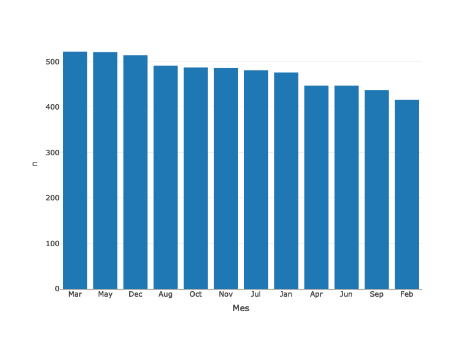
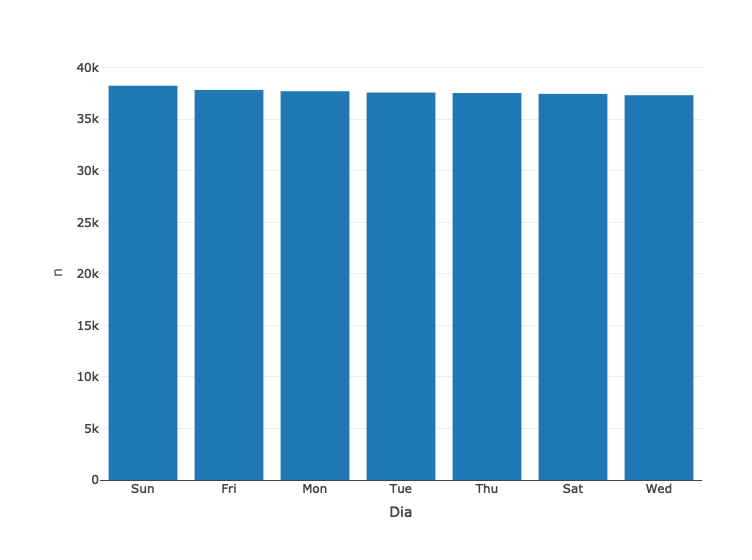
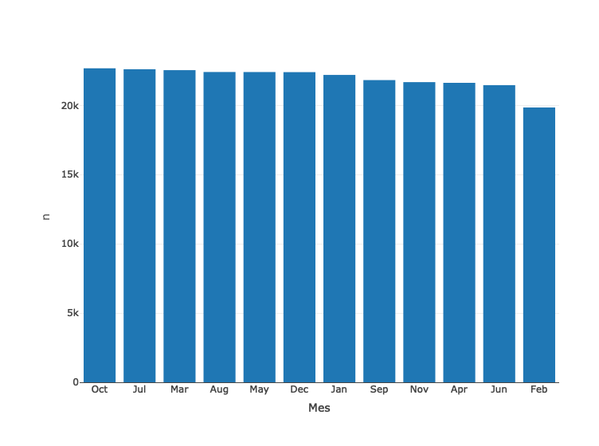
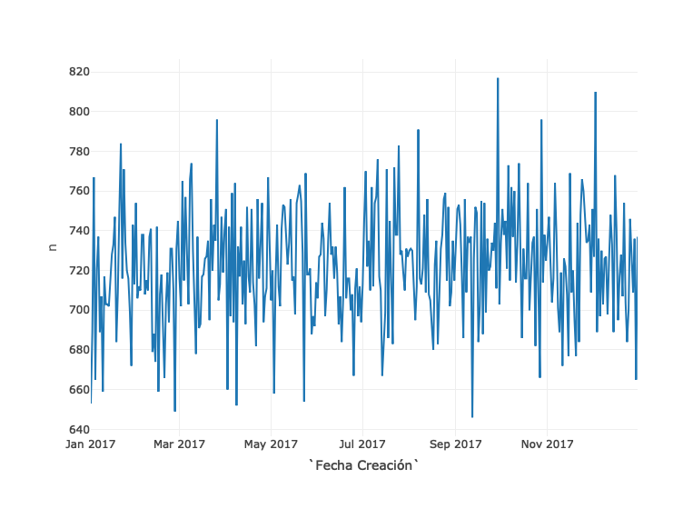
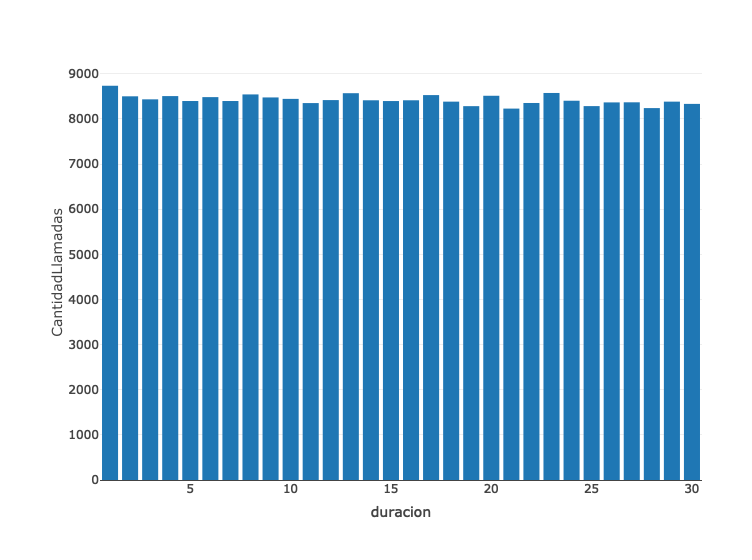

Laboratorio 5
================
Melany 20170474
9/4/2019

``` r
require(lubridate)
```

    ## Loading required package: lubridate

    ## 
    ## Attaching package: 'lubridate'

    ## The following object is masked from 'package:base':
    ## 
    ##     date

``` r
ultimo_eclipse <- "21-08-2017 18:26:40"
ultimo_eclipse <- dmy_hms(ultimo_eclipse)
SynodicMonth <- days(29) + hours(12) + minutes(44) + seconds(3)
saros <- 223*SynodicMonth
siguiente_eclipse <- ultimo_eclipse + saros
siguiente_eclipse
```

    ## [1] "2035-09-02 02:09:49 UTC"

``` r
library(readr)
library(dplyr)
```

    ## Warning: package 'dplyr' was built under R version 3.5.2

    ## 
    ## Attaching package: 'dplyr'

    ## The following objects are masked from 'package:lubridate':
    ## 
    ##     intersect, setdiff, union

    ## The following objects are masked from 'package:stats':
    ## 
    ##     filter, lag

    ## The following objects are masked from 'package:base':
    ## 
    ##     intersect, setdiff, setequal, union

``` r
require(plotly)
```

    ## Loading required package: plotly

    ## Loading required package: ggplot2

    ## 
    ## Attaching package: 'plotly'

    ## The following object is masked from 'package:ggplot2':
    ## 
    ##     last_plot

    ## The following object is masked from 'package:stats':
    ## 
    ##     filter

    ## The following object is masked from 'package:graphics':
    ## 
    ##     layout

``` r
datos <- read_csv('/Users/melany/Desktop/Data Wrangling/Github/Laboratorio 5/data.csv')
```

    ## Parsed with column specification:
    ## cols(
    ##   `Fecha Creación` = col_character(),
    ##   `Hora Creación` = col_time(format = ""),
    ##   `Caller ID` = col_double(),
    ##   Cod = col_character(),
    ##   Email = col_double(),
    ##   SMS = col_double(),
    ##   Call = col_double(),
    ##   `Fecha Final` = col_character(),
    ##   `Hora Final` = col_time(format = "")
    ## )

``` r
head(datos)
```

    ## # A tibble: 6 x 9
    ##   `Fecha Creación` `Hora Creación` `Caller ID` Cod   Email   SMS  Call
    ##   <chr>            <drtn>                <dbl> <chr> <dbl> <dbl> <dbl>
    ## 1 10/12/17         22:18                368224 Canc…     0     1     0
    ## 2 19-03-17         17:35                368224 Otro…     0     1     0
    ## 3 13-03-17         22:03                368224 Cons…     0     1     0
    ## 4 14-04-17         17:55                368224 Cons…     0     1     0
    ## 5 11/4/17          09:08                748633 Cons…     0     1     0
    ## 6 29-04-17         07:19                599434 Canc…     0     1     0
    ## # … with 2 more variables: `Fecha Final` <chr>, `Hora Final` <drtn>

``` r
datos$`Fecha Creación` <- dmy(datos$`Fecha Creación`)
datos$Mes <- month(datos$`Fecha Creación`, label = T)
datos$Dia <- wday(datos$`Fecha Creación`, label = T)

datos$Inicio <- paste(datos$`Fecha Creación`,datos$`Hora Creación`)
datos$Inicio <- ymd_hms(datos$Inicio)
datos$Final <- paste(datos$`Fecha Final`,datos$`Hora Final`)
datos$Final <- dmy_hms(datos$Final)
```

``` r
datos1 <- datos %>% select(Cod, Call, Mes) %>% filter(Call == "1") %>% group_by(Cod, Mes) %>% count(Call, sort = TRUE)
datos1
```

    ## # A tibble: 12 x 4
    ## # Groups:   Cod, Mes [12]
    ##    Cod                          Mes    Call     n
    ##    <chr>                        <ord> <dbl> <int>
    ##  1 Actualización de Información Mar       1   522
    ##  2 Actualización de Información May       1   521
    ##  3 Actualización de Información Dec       1   514
    ##  4 Actualización de Información Aug       1   491
    ##  5 Actualización de Información Oct       1   487
    ##  6 Actualización de Información Nov       1   486
    ##  7 Actualización de Información Jul       1   481
    ##  8 Actualización de Información Jan       1   476
    ##  9 Actualización de Información Apr       1   447
    ## 10 Actualización de Información Jun       1   447
    ## 11 Actualización de Información Sep       1   437
    ## 12 Actualización de Información Feb       1   416

``` r
datos1$Mes <- factor(datos1$Mes, levels = unique(datos1$Mes)[order(datos1$n, decreasing = TRUE)])
datos1 %>% plot_ly(x= ~Mes, y = ~n, type= "bar")
```



``` r
#El mes con mas llamdas es marzo con el codigo de actualizacion de informacion
```

``` r
datos2 <- datos %>% select(Dia) %>% group_by(Dia) %>% summarise(n = n()) %>% arrange(desc(n))
datos2
```

    ## # A tibble: 7 x 2
    ##   Dia       n
    ##   <ord> <int>
    ## 1 Sun   38248
    ## 2 Fri   37843
    ## 3 Mon   37714
    ## 4 Tue   37588
    ## 5 Thu   37544
    ## 6 Sat   37459
    ## 7 Wed   37329

``` r
datos2$Dia <- factor(datos2$Dia, levels = unique(datos2$Dia)[order(datos2$n, decreasing = TRUE)])
datos2 %>% plot_ly(x= ~Dia, y = ~n, type= "bar")
```



``` r
#El dia mas ocupado es el domingo
```

``` r
datos3 <- datos %>% select(Mes) %>% group_by(Mes) %>% summarise(n = n()) %>% arrange(desc(n))
datos3
```

    ## # A tibble: 12 x 2
    ##    Mes       n
    ##    <ord> <int>
    ##  1 Oct   22681
    ##  2 Jul   22613
    ##  3 Mar   22547
    ##  4 Aug   22413
    ##  5 May   22410
    ##  6 Dec   22403
    ##  7 Jan   22202
    ##  8 Sep   21829
    ##  9 Nov   21681
    ## 10 Apr   21631
    ## 11 Jun   21464
    ## 12 Feb   19851

``` r
datos3$Mes <- factor(datos3$Mes, levels = unique(datos3$Mes)[order(datos3$n, decreasing = TRUE)])
datos3 %>% plot_ly(x= ~Mes, y = ~n, type= "bar")
```



``` r
#El mes mas ocupado es octubre
```

``` r
datos4 <- datos %>% select(`Fecha Creación`) %>% group_by(`Fecha Creación`) %>% summarise(n = n()) 
datos4
```

    ## # A tibble: 365 x 2
    ##    `Fecha Creación`     n
    ##    <date>           <int>
    ##  1 2017-01-01         653
    ##  2 2017-01-02         689
    ##  3 2017-01-03         767
    ##  4 2017-01-04         665
    ##  5 2017-01-05         721
    ##  6 2017-01-06         737
    ##  7 2017-01-07         689
    ##  8 2017-01-08         707
    ##  9 2017-01-09         659
    ## 10 2017-01-10         717
    ## # … with 355 more rows

``` r
datos4 %>% plot_ly(x= ~`Fecha Creación`, y = ~n, type = 'scatter', mode = 'lines')
```



``` r
#No existe una temporalidad porque no existe una tendencia de lamadas en el tiempo.
```

``` r
datos$duracion <- difftime(datos$Final, datos$Inicio, units = "mins")
datos5 <- data.frame(datos %>% select(duracion) %>% filter(duracion >0))
promedio <- mean(datos5$duracion)
promedio
```

    ## Time difference of 15.43919 mins

``` r
#La llamada promedio dura 15 minutos tomando en cuenta la duracion de las llamadas positivas.
```

``` r
datos6 <- data.frame(datos %>% select(duracion) %>% filter(duracion >0) %>% group_by(duracion) %>%  summarise(CantidadLlamadas = n()))
datos6
```

    ##    duracion CantidadLlamadas
    ## 1    1 mins             8735
    ## 2    2 mins             8501
    ## 3    3 mins             8434
    ## 4    4 mins             8506
    ## 5    5 mins             8397
    ## 6    6 mins             8483
    ## 7    7 mins             8397
    ## 8    8 mins             8543
    ## 9    9 mins             8476
    ## 10  10 mins             8444
    ## 11  11 mins             8351
    ## 12  12 mins             8417
    ## 13  13 mins             8570
    ## 14  14 mins             8413
    ## 15  15 mins             8396
    ## 16  16 mins             8413
    ## 17  17 mins             8528
    ## 18  18 mins             8383
    ## 19  19 mins             8283
    ## 20  20 mins             8513
    ## 21  21 mins             8229
    ## 22  22 mins             8353
    ## 23  23 mins             8575
    ## 24  24 mins             8403
    ## 25  25 mins             8284
    ## 26  26 mins             8366
    ## 27  27 mins             8368
    ## 28  28 mins             8240
    ## 29  29 mins             8383
    ## 30  30 mins             8333

``` r
datos6 %>% plot_ly(x= ~duracion, y = ~CantidadLlamadas, type= "bar")
```


